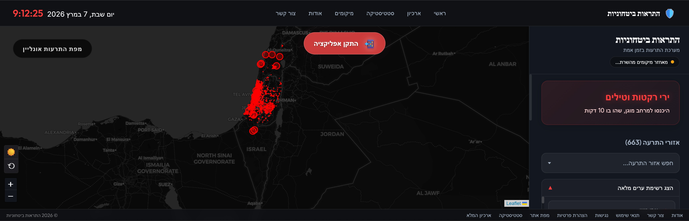

# Pikud Haoref Alerts API

This repository contains a FastAPI wrapper around the official Israel Home Front Command (Pikud Haoref) alerts API. It provides a structured, modern API endpoint to fetch real-time active alerts, complete with built-in interactive Swagger UI documentation and standardized logging.

## Screenshots

<div align="center">
  
  
</div>


## Features

- **Real-time Dashboard**: Interactive Map (Leaflet) with live alert updates and visual status indicators.
- **Israel-First Geocoding**: Optimized location search using localized OSM data with aggressive caching.
- **Environment-Aware Proxy**: Automatically uses a high-performance proxy on Railway to bypass 403 blocks, while using efficient direct connections on localhost.
- **24-Hour Session Persistence**: Maintains persistent session state to minimize connection overhead and bypass rate limits.
- **Configurable Alert Persistence**: State accumulation ensures city markers gracefully persist on the map for a configurable duration (default 10m) giving users time to process the event.
- **System Reliability Notifications**: Real-time red warning banners and status indicators if the Oref API connection is interrupted.
- **Adaptive Polling**: Automatically scales polling frequency between Routine (gentle) and Emergency (rapid) modes based on threat level.
- **SQLite History & Stats**: Automatic 24h history recording and SQLite-backed statistics for all intercepted alerts.
- **Desktop Notifications & Audio**: Optional voice synthesis (Hebrew) and synthetic siren/bell alarms for immediate awareness.
- **PWA Ready**: Mobile-friendly manifest and service worker for "Add to Home Screen" support.

## Prerequisites

- Python 3.8+

## Setup Instructions

1. **Clone the repository:**
   ```bash
   git clone <repository_url>
   cd PikudHaoref_Alerts
   ```

2. **Create a virtual environment (optional but recommended):**
   ```bash
   python -m venv venv
   # On Windows:
   venv\Scripts\activate
   # On macOS/Linux:
   source venv/bin/activate
   ```

3. **Install dependencies:**
   ```bash
   pip install -r requirements.txt
   ```

## Running the Application

To start the development server, run:

```bash
uvicorn app.main:app --reload
```

The server will start at `http://localhost:8000`.

## Interactive API Docs (Swagger UI)

Once the application is running, you can explore and test the endpoints directly from your browser by navigating to:

**[http://localhost:8000/docs](http://localhost:8000/docs)**

## Configuration

The application uses a `config.json` file in the root directory for core settings:

```json
{
    "scheduler": {
        "routine_interval_seconds": 120,
        "emergency_interval_seconds": 10
    },
    "map": {
        "marker_display_duration_minutes": 10
    }
}
```
- **routine_interval_seconds**: Polling frequency when no alerts are active.
- **emergency_interval_seconds**: High-speed polling frequency during a detected attack.
- **marker_display_duration_minutes**: How long city markers securely persist on the dashboard map after the alert begins.

## Proxy Management

To bypass 403 blocks from the Oref servers when deployed in cloud environments (like Railway), the system uses a high-performance dedicated proxy configured in `config.json`.

**Example `config.json`:**
```json
{
    "proxy": {
        "url": "185.241.5.57:3128",
        "type": "http"
    }
}
```

- **Railway**: Automatically routes all Oref traffic through the proxy defined in the config.
- **Development/Local**: Uses direct connection for maximum speed.
- **Persistence**: Uses a shared `requests.Session` with automatic cookie management to ensure consistent bypass success.

## Swagger API Services 

The project uses FastAPI, which automatically generates a Swagger UI at `/docs`. Below is a comprehensive list of all available REST services and their capabilities:

| Service / Endpoint | Method | Parameters | Description |
|---------------------|--------|------------|-------------|
| `/api/config` | `GET` | None | **Get App Configuration**. Returns public server settings (like map marker duration) loaded from `config.json`. |
| `/api/alerts` | `GET` | `mock` (bool) | **Get Active Alerts**. Fetches currently active alerts instantaneously from memory. Pass `?mock=true` to simulate a massive attack for UI/audio testing. |
| `/api/alerts/history` | `GET` | `hours` (int, default: 24) | **Get Alert History**. Retrieves all alerts that occurred within the specified timeframe from the local SQLite database. |
| `/api/alerts/statistics` | `GET` | `timeframe` (str, default: '24h') | **Get Alert Statistics By City**. Aggregates alert counts per city. Supported timeframes: `24h, 1w, 1m, 6m, 1y, all`. |
| `/api/alerts/quiet_times` | `GET` | `city` (str, optional) | **Get Best Times (Lowest Alert Frequency)**. Analyzes historical data to find the safest hours (00-23) either globally or for a specific city. |
| `/api/geocode` | `POST` | `cities` (list[str]) | **Resolve Coordinates**. Accepts a list of cities and returns their GeoJSON shapes. Serves as a fast backend proxy to Nominatim. |
| `/api/geolocations_list` | `GET` | None | **Get Geolocation Status**. Returns a list of all historically recorded cities and marks whether they have cached geographical coordinates locally. |
| `/api/geolocations/sync` | `POST` | None | **Manual Geolocation Sync**. Forces the background worker to execute a batch of missing geolocations immediately to fill the cache. |
| `/rss` | `GET` | None | **Get Alert RSS Feed**. Returns a real-time XML RSS feed of recent alerts. |
| `/health` | `GET` | None | **System Health Check**. Lightweight health check endpoint for Cloud/Railway deployment platforms. |

## Dashboard Access

Navigate to the root URL `/` to access the interactive dashboard.
- **Mock Mode**: Add `?mock=true` to the URL to simulate a massive attack for testing UI/Audio.

## Project Architecture

For a detailed technical breakdown of the accumulation logic, proxy rotator, and database schema, please refer to the [architecture.md](architecture.md) file.
